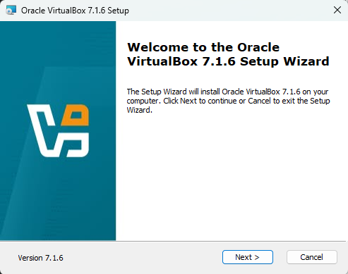

# Instalação do VirtualBox

## Download do Instalador

- Inicie a Instalação do arquivo que você já baixou. O windows pedirá que você "autorize" a instalação, clique em SIM. Se estiver usando o MacOS ele pode ou não pedir para autorizar.
- A próxima tela que você verá será o início da instalação, prossiga e responda aos questionamentos que o instalador fará. 

__
Pergunte em TODAS dúvidas!!!
__

