# Instalação do VirtualBox

## Iniciando a Instalação

- Vamos dividir este tópico em dois. Clique no sistema operacional que você usa para acessar o conjunto de instruções correto:

  <a href="#instalação-no-windows">WINDOWS</a>

  <a href="#instalação-no-macos">MACOS</a>

💡 <strong>Dica:</strong> Pergunte em TODAS dúvidas!!!

---

- Se você já instalou o VirtualBox, pode seguir para a [Instalação do Linux](#preparando-a-instalação-do-linux-ubuntu-2204)
---

### Instalação no Windows
- Neste exemplo estamos usando o Windos 11 24h2 e o instalador do link mostrado na primeira página.
- Dê um duplo clique no arquivo que você baixou e siga a instalação.

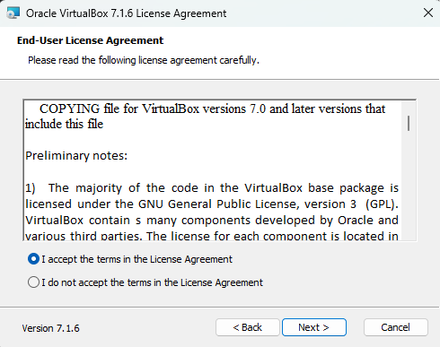
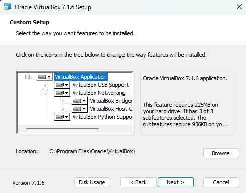
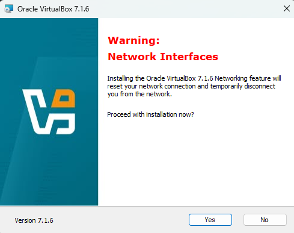
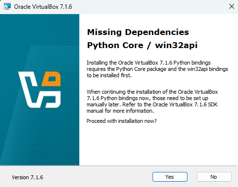
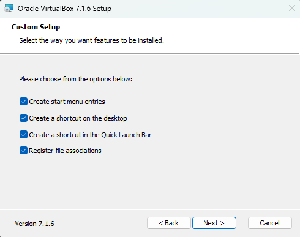

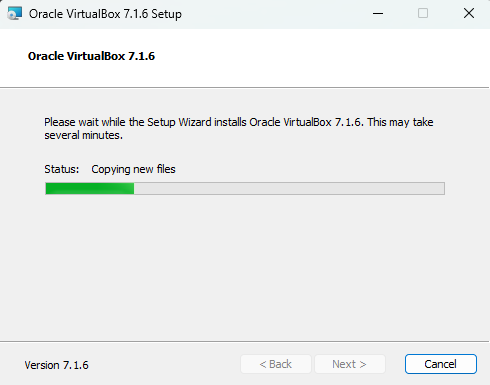
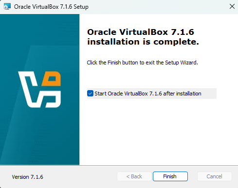

  <a href="#preparando-a-instalação-do-linux-ubuntu-2204">Preparando a Instalação do Linux</a>

### Instalação no MacOS
- Neste exemplo estamos usando MacOS Ventura e o instalador do link mostrado na primeira página.
- Após o download, execute o arquivo de extenção dmg. Ele montará um disco virtual com a instalação do VirtualBox.

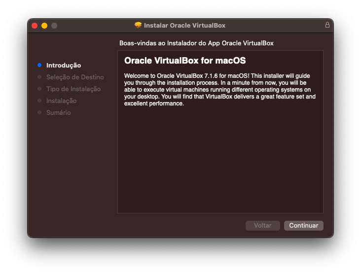
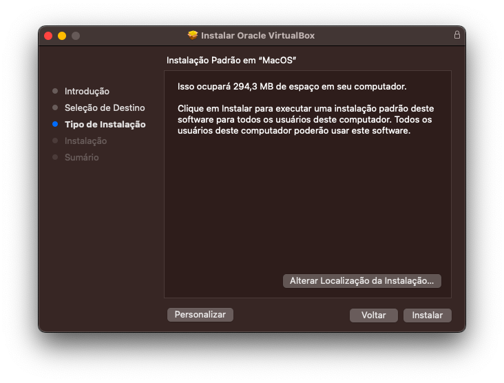
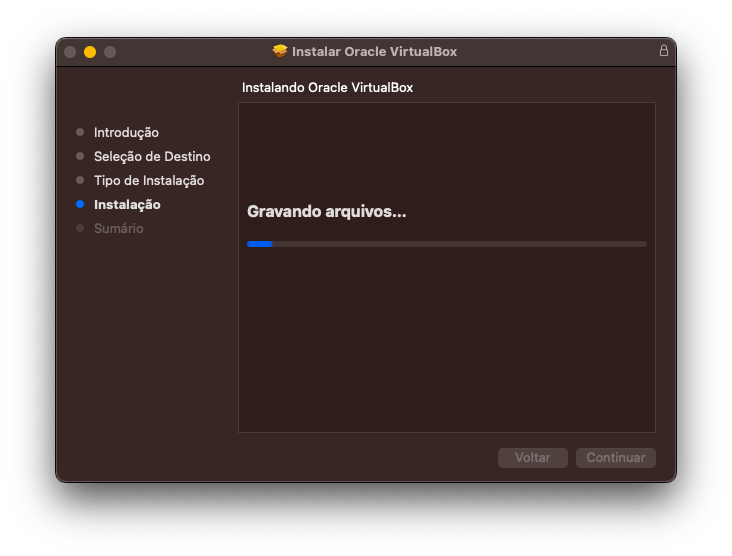

Nos últimos momentos da instalação, aparecerá este aviso no canto superior direito, basta fechar.

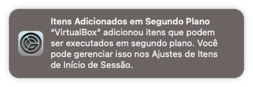
 

### Preparando a Instalação do Linux Ubuntu 22.04

- A partir deste ponto, tanto a instalação no Windows como no Linux os passos serão os mesmos. Estaremos usando as imagens da instalação no Windows por ser o SO mais utilizado, se você está usando MacOS e tiver dúvidas **PERGUNTE** a sua dúvida é muito importante para todos!!

---

Com o VirtualBox aberto, você deve clicar em NOVO:

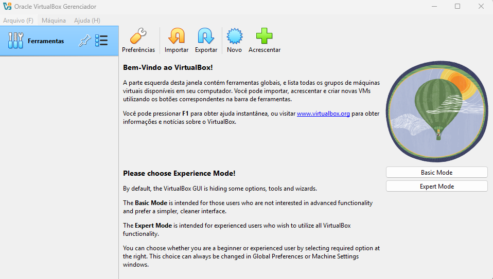

Na tela que abrir, você dará o nome da Máquina Virtual e o caminho. Em seguida os campos de:

Imagem ISO :<strong>Selecione o arquivo de Imagem ISO que você baixou. Encontrado nos links na pagina inicial desta atividade.</strong>

Tipo :<strong>Linux;</strong>

Subtipo :<strong>Ubuntu;</strong>

Versão :<strong>Ubuntu (64-bit);</strong>

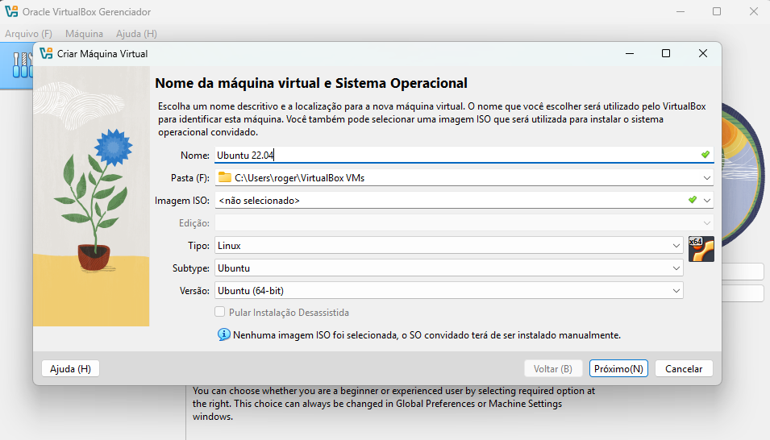

Clique em Próximo
  

Agora escolha quanto do seu hardware ficará "dedicado" à máquina virtual.

Usualmente ele recomenda o mínimo necessário para o sistema funcionar, é extremamente recomendável que dedique um pouco mais do hardware. Em situações do dia a dia é interessante, oa menos, metade dos seus núcleos e metade de sua memória RAM. Mas <strong>cuidado</strong> para não entrar na área em <strong>vermelho</strong>, se deixar pouco recurso para o sistema operacional da máuqina, você travará o seu computador assim que iniciar a máquina virtual.

Clique em Próximo
  

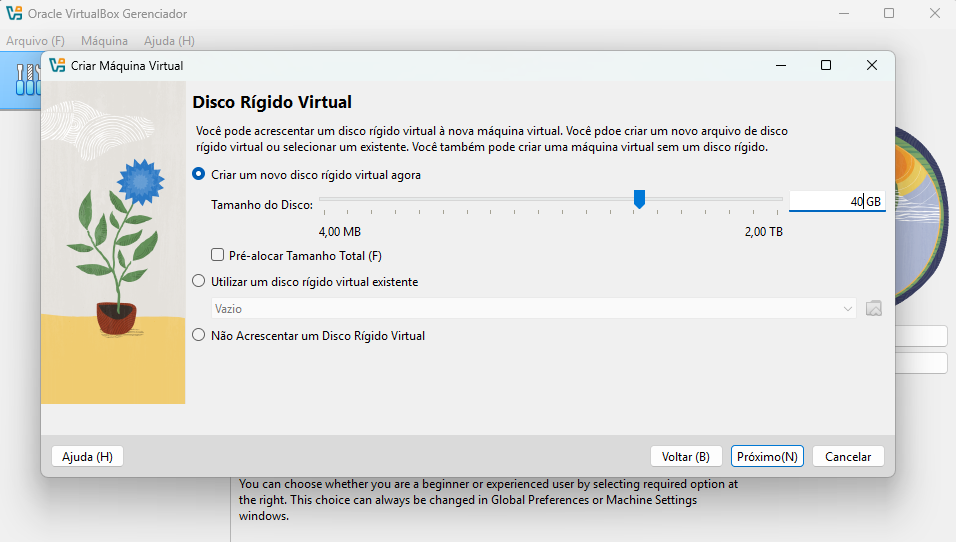

Chegou o momento de dizer o tamnho do seu disco virtual.

Não recomendo deixar menos de 40G. Não há necessidade para <strong>pânico</strong> pois a alocação deste disco é dinâmica, você não ficará com todo o espaço "preso" neste aruivo. Para isso é só <strong> não clicar</strong> no checkbox.

Clique em Próximo
  

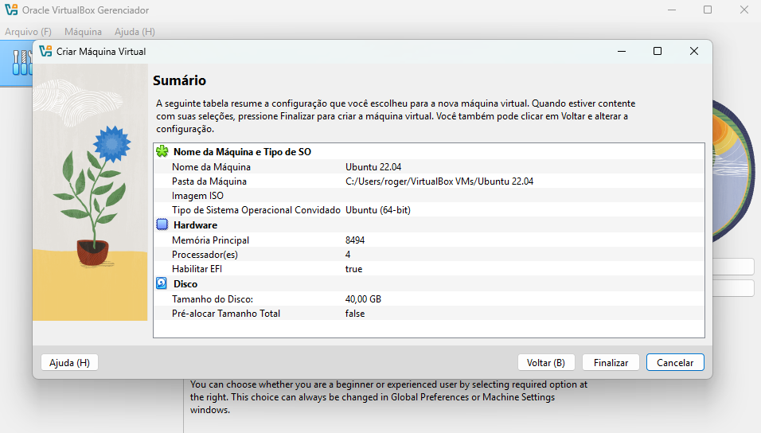

Sumário

Nesta tela você poderá revisar tudo o que escolheu e finalizar a configuração da sua máquina virtual, clicando em Finalizar.
 

Os próximos passos serão os mesmos para as máquinas virtuais e a instalação diretamente no computador.

Próximo passo: [Instalação do Ubuntu](modules/03-ubuntu/Ubuntu.md)