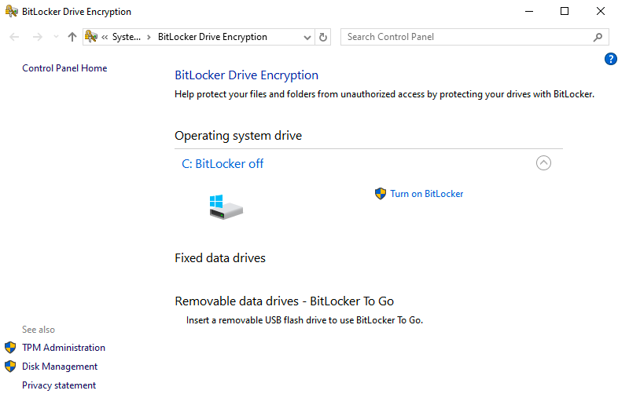
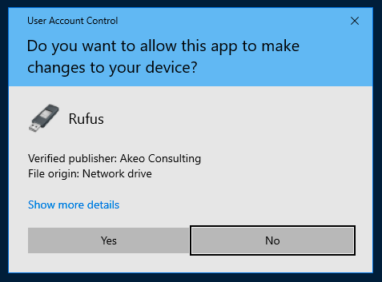
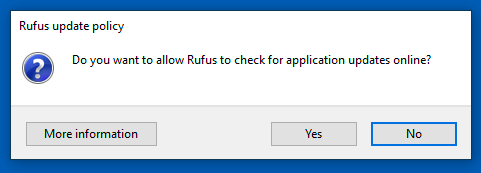

# Fazer o Dual Boot

Ao escolher a opção de fazer dual boot, é **fortemente recomendável** que você faça uma cópia de segurança de todos os seus dados importantes. Existe uma possibilidade significativa de perda de dados durante o processo de instalação e configuração do dual boot[1][2].

Alguns pontos importantes a considerar:

1. Backup completo: Faça uma cópia de segurança de todos os arquivos, documentos, fotos e outros dados que você não pode se dar ao luxo de perder.

2. Risco envolvido: O processo de particionamento do disco e instalação de um novo sistema operacional ao lado do existente pode resultar em perda de dados se não for feito corretamente.

3. Precaução: Esta recomendação enfatiza a importância de se preparar adequadamente antes de prosseguir com a instalação do dual boot.

4. Dados críticos: Preste atenção especial aos dados que são insubstituíveis ou difíceis de recuperar.

Lembre-se de que, embora o dual boot ofereça a vantagem de ter dois sistemas operacionais em um único computador, é crucial abordar o processo com cautela e preparação adequada para minimizar os riscos de perda de dados.

Antes de iniciar a instalação do Linux em dual boot, é importante verificar e desativar a criptografia de disco no Windows, caso esteja ativada. Isso é necessário para posteriormente desligar o Secure Boot na BIOS. Siga estes passos para verificar e desativar a criptografia de disco BitLocker no Windows:

1. Clique no botão Iniciar
2. Acesse o Painel de Controle
3. Vá até Sistema e Segurança
4. Clique em Criptografia de Unidade de Disco BitLocker

Na tela que aparecer, você poderá verificar se o BitLocker está ativado. Caso esteja, siga estas instruções para desativá-lo:

Para desativar o BitLocker:

1. Clique em "Desativar BitLocker" ao lado da unidade criptografada
2. Confirme a ação quando solicitado
3. O processo de descriptografia será iniciado, o que pode levar algum tempo dependendo do tamanho da unidade
4. Você pode continuar usando o computador durante o processo de descriptografia
5. Após a conclusão, o BitLocker estará desativado para aquela unidade

É importante desativar o BitLocker antes de prosseguir com a instalação do Linux em dual boot, pois a criptografia pode causar problemas de compatibilidade. Após desativar o BitLocker, você poderá prosseguir com a desativação do Secure Boot na BIOS e a instalação do Linux.

💡 <strong>Dica:</strong> - Você tem o OneDrive pela sua conta Microsoft do INSPER (e-mail do aluno).

> Se você usa Windows, a integração com o OneDrive funciona muito bem e mantém, automaticamente, uma cópia online dos seus arquivos e de suas configurações básicas (dependendo de como configurou).

> Se você usa MacOS (A partir do Yosemite - 10.10 - 2014) a integração com o iCloud Drive funciona muito bem e mantém, automaticamente, uma cópia online.

 

	•	Clique em Desativar BitLocker ao lado da unidade criptografada.
	•	Aguarde a descriptografia completa do disco antes de prosseguir.
 
Agora precisamos criar o pendrive de instalação do Ubuntu 22.04. Para este passo, você deve instalar o <strong>rufus</strong>.   

Você já baixou este arquivo no mesmo momento em que baixou o arquivo <strong>iso</strong> no início da atividade: [Arquivos](../../index.md#arquivos)

Após executar o arquivo, você verá um pedido de autorização de execução do windows:

 
Clique em <strong>SIM</strong> e abrirá uma janela perguntando se quer buscar por atualizações:
  

 
Clique em <strong>SIM</strong> novamente. Após verificar se existem atualizações, ele abrirá a tela principal do rufus:

 
Nesta tela, você deve escolher as seguintes opções: 
- Device: O Pendrive em que gravará a instalação do Ubuntu; 
- Botão <strong>SELECT</strong>: Selecionar o arquivo .iso do Ubuntu que você baixou; 
- Partition Scheme: <strong>GPT</strong>; 
- Target System: <strong>UEFI</strong>. 
 
As demais opções, mantenha como padrão.
  

Agora clique em <strong>START (INICIAR)</strong>.

Após terminar, clique em <strong>close</strong> e desligue o computador <strong>com o pendrive conectado</strong>. Você deve reiniciar e entrar na BIOS para os próximos ajustes.
 

💡 <strong>Dica:</strong> A próxima etapa (BIOS) faremos juntos para que não tenhamos problemas. Cada fabricante tem uma bios própria e veremos caso a caso.

 
Após desativar a criptografia, reinicie o computador e acesse as configurações da BIOS/UEFI para desabilitar o Secure Boot. O procedimento pode variar conforme o fabricante, mas geralmente envolve:

	1.	Reiniciar o computador enquanto mantém pressionada a tecla específica para acessar a BIOS (geralmente F2, DEL ou ESC).
	2.	Navegar até a aba de segurança ou inicialização (Security ou Boot).
	3.	Localizar a opção Secure Boot e defini-la como Disabled.
	4.	Salvar as alterações e sair da BIOS.
Com o Secure Boot desativado e o disco descriptografado, você estará pronto para iniciar a instalação do Linux em dual boot.
  

💡 <strong>Dica:</strong> - Lembre-se de que as telas e nomes podem variar de acordo com a atualização e versão do seu windows.

Agora vamos iniciar o computador pelo pendrive. Para esta etapa, se for um notebook da <strong>DELL</strong> pressione repetidamente a tecla <strong>F12</strong> após ligar o computador, assim acessará o menu de boot do computador. Se for um computador de outra marca, é necessário saber como entrar no menu, mas é provavel que seja com <strong>F8 ou F10</strong> e se for um computador <strong>Thinkpad</strong> você deve precionar <strong>ENTER</strong> durante a inicialização quando ele mandar.

Após aparecer o menu, escolha o pendrive e tecle enter.

Próximo passo: [Instalação do Ubuntu](../03-ubuntu/Ubuntu.md)

