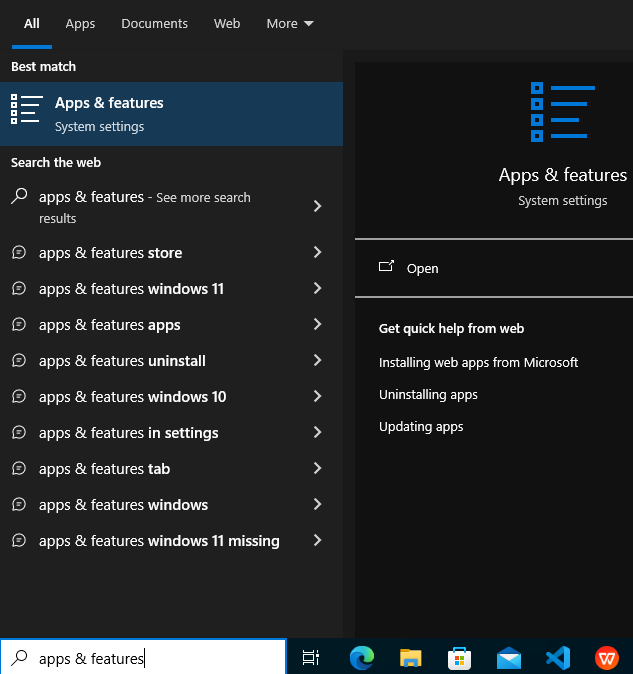
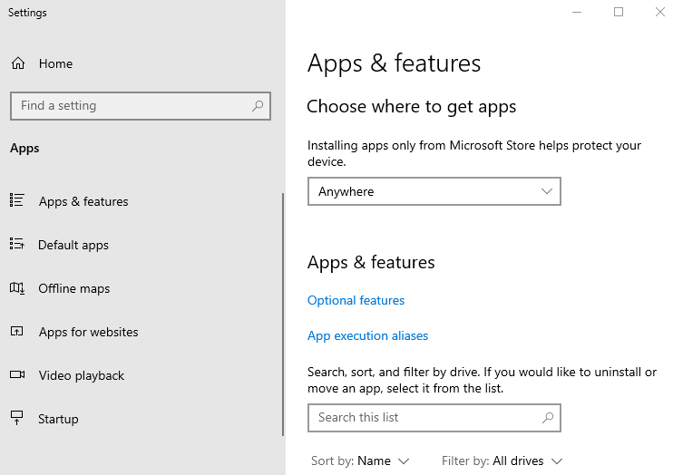
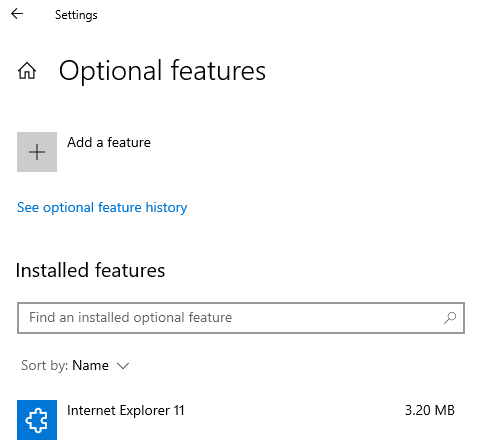
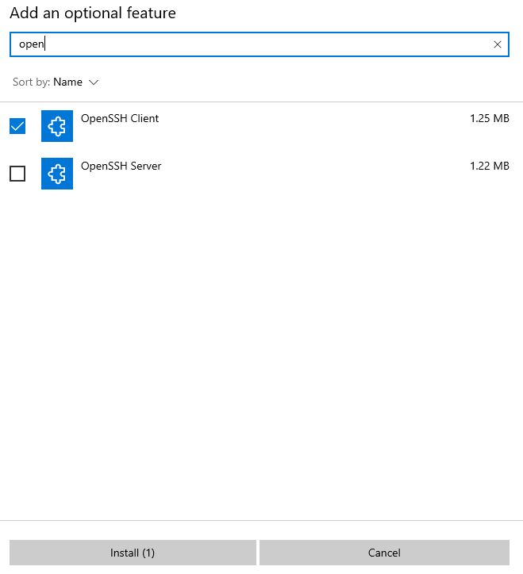
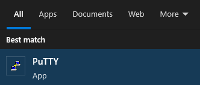
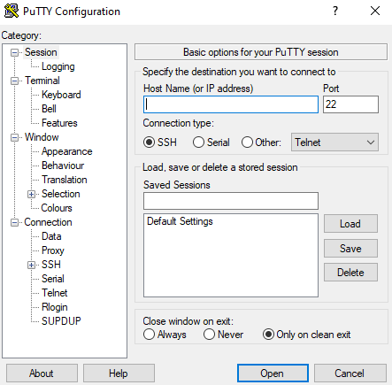

# Instalação SSH

Durante as atividades deste laboratório, iremos realizar a conexão com uma **máquina virtual** Linux hospedada na AWS (serviços de computação em nuvem da Amazon).


Para realizar a conexão entre o seu computador e a máquina virtual, iremos utilizar um cliente `ssh`.

O **SSH** (Secure Shell) é um protocolo de rede criptografado amplamente utilizado para estabelecer conexões seguras e autenticadas entre computadores.
    
Ele permite que usuários acessem e controlem remotamente sistemas operacionais e serviços, através de uma conexão criptografada.

!!! info
    O **SSH** é amplamente utilizado por administradores de sistemas e desenvolvedores para realizar tarefas como:
    
    - Gerenciamento de servidores.
    - Transferência de arquivos.
    - Acesso remoto a máquinas.

## Verificar instalação

Abra o menu iniciar de seu sistema e digite `terminal` ou `command prompt`. Deve aparecer uma tela semelhante a esta:

<div class="termy">

    ```console
    $
    ```

</div>
<br>

O terminal, Power Shell, Command Prompt ou Prompt de Comando, é uma interface de **linha de comando**. Este tipo de ferramenta permite aos usuários interagir com o sistema operacional, digitando **comandos de texto** para executar tarefas específicas.

!!! exercise
    Vamos tentar utilizar o comando `ssh`. Digite o comando e verifique se obtem um erro de *comando não reconhecido*. Caso sim, prossiga e faça a instalação.

    <div class="termy">

    ```console
    $ ssh
    'ssh' is not recognized as an internal or external command, operable program or batch file.
    ```

    </div>

!!! info
    Se você está no **macOS** ou **Linux**, provavelmente já tem o cliente `ssh` instalado!


### Instalação e uso no Windows

Escolha entre as opções 1 e 2, realizando **apenas uma** delas.

#### Opção 1: Instalação OpenSSH.

No menu iniciar, digite `apps & features` (talvez tenha que digitar `programas` ou `aplicativos` se estiver em português). Acesse a opção, conforme imagem:



Em seguida, acesse `optional features` no centro da tela:



Escolha a opção para adicionar nova feature:



Na nova tela, procure por `OpenSSH`, marque a opção `OpenSSH Client` e clique no botão para fazer instalação:



!!! exercise
    Vamos tentar utilizar o comando `ssh`. Digite o comando no terminal e verifique se obtem um retorno que indique que o ssh está instalado, semelhante a:

    <div class="termy">

    ```console
    $ ssh
    usage: ssh [-46AaCfGgKkMNnqsTtVvXxYy] [-B bind_interface] [-b bind_address] [-c cipher_spec] [-D [bind_address:]port] [-E log_file] [-e escape_char] [-F configfile] [-I pkcs11] [-i identity_file] [-J [user@]host[:port]] [-L address] [-l login_name] [-m mac_spec] [-O ctl_cmd] [-o option] [-p port] [-Q query_option] [-R address] [-S ctl_path] [-W host:port] [-w local_tun[:remote_tun]] destination [command] 
    ```

    </div>

#### Opção 2: PuTTY

!!! danger "Importante!"
    Se você já fez a instalação pela **Opção 1**, não precisa fazer a **Opção 2**, apenas pule para a próxima página do material!

Você pode utilizar o **PuTTY** para realizar a conexão ssh. Neste caso, [**clique AQUI**](https://www.chiark.greenend.org.uk/~sgtatham/putty/latest.html) e realize o download / Instalação.

!!! exercise
    Baixe o executável adequado para seu sistema e faça a instalação (entregue sua alma ao instalador, apenas clique em **Avançar** até terminar a instalação!)

!!! exercise
    Para testar a instalação, procure (e acesse) o PuTTY no menu iniciar do sistema:

    

    Confira se abriu uma tela semalhante a:

    

    Feche o programa PuTTY e prossiga no material!

### Instalação no iPad ou Tablet Android

Caso utilize um Tablet, você pode fazer a instalação do App Termius na [**App Store para iPad**](https://apps.apple.com/br/app/termius-terminal-ssh-client/id549039908) ou [**Google Play**](https://play.google.com/store/apps/details?id=com.server.auditor.ssh.client&hl=pt_BR&gl=US).

## Referências
- https://miro.medium.com/v2/resize:fit:699/1*bQLzdc3np51pPnvIERS1-A.jpeg
- https://pt.wikipedia.org/wiki/Secure_Shell