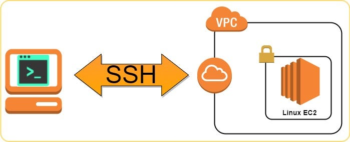
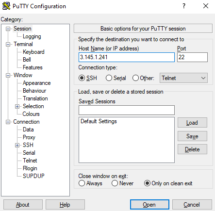

# Conexão SSH com uma Máquina Virtual na AWS

Agora que temos o cliente **SSH** instalado em nossos computadores, vamos utilizar o **SSH** para acessar uma **máquina virtual** Linux hospedada na AWS (serviços de computação em nuvem da Amazon).



Nesta aula, iremos aprender a utilizar alguns comandos do Linux. Os comandos enviados serão todos executados nesta máquina remota (acessada por `ssh`).

!!! info
    Caso ainda não tenha recebido as informações de acesso, pergunte ao professor:

    - O **host**.
    - O **usuário**.
    - A **senha**.

!!! info
    O SSH é amplamente utilizado por administradores de sistemas e desenvolvedores para realizar tarefas como:
    
    - Gerenciamento de servidores.
    - Transferência de arquivos.
    - Acesso remoto a máquinas.

## Realizar conexão

Vamos realizar a conexão SSH. Para isto, será importante você lembrar se realizou a instação do cliente SSH:

- Direto no Windows (Opção 1):
    - Neste caso, utilize o `terminal` ou `command prompt`.
- PuTTY (Opção 2):
    - Abra o PuTTY e configure o host.

!!! danger "Atenção!"
    Em todas as etapas da aula, substitua o **IP** `3.145.1.241` pelo IP do host fornecido pelo professor.

!!! info
    O endereço **IP** (do inglês *Internet Protocol*) é como um endereço único atribuído a cada dispositivo conectado à internet. Assim como uma casa tem um endereço para receber correspondências, um dispositivo tem um endereço IP para enviar e receber dados na internet.

Utilize abaixo a opção adequada, conforme sua instalação:

=== "Opção 1: terminal"

    Basta substituir o IP no comando. Utilize o IP fornecido pelo professor, o do terminal é apenas um exemplo.

    <div class="termy">

    ```console
    $ ssh boss@3.145.1.241
    ```

    </div>

    Ao apertar **ENTER**, será solicitado que confirme o desejo de continuar a conexão e informe a senha.
    
    !!! info
        Digite `yes` e a senha fornecida pelo professor!
    
    <div class="termy">

    ```console
    $ ssh boss@3.145.1.241
    The authenticity of host '3.145.1.241 (3.145.1.241)' can't be established.
    ED25519 key fingerprint is SHA256:EG7YpJvK8j+JLyEiw7MO055W+Aty9nMJWuAuE4hERsI.
    This key is not known by any other names
    Are you sure you want to continue connecting (yes/no/[fingerprint])? yes
    Warning: Permanently added '3.145.1.241' (ED25519) to the list of known hosts.
    (boss@3.145.1.241) Password:
    ```

    </div>

=== "Opção 2: PuTTY"
    Informe o **IP** do host. Utilize o IP fornecido pelo professor, o da imagem é apenas um exemplo
    

    Clique em **Open** e, na próxima tela, aceite a conexão. Então, informe o usuário e senha fornecido pelo professor.


    <div class="termy">

    ```console
    login as: boss
    Keyboard-interactive authentication prompts from server:
    | Password:
    ```

    </div>
    

!!! exercise
    Garanta que conseguiu realizar os passos acima, e obtem uma mensagem que indique que a conexão **SSH** foi realizada, semelhante a:

    <div class="termy">

    ```console
    Welcome to Ubuntu 22.04.4 LTS (GNU/Linux 6.5.0-1018-aws x86_64)

    * Documentation:  https://help.ubuntu.com
    * Management:     https://landscape.canonical.com
    * Support:        https://ubuntu.com/pro

    System information as of Wed May  1 14:13:46 UTC 2024

    System load:  0.0               Processes:             99
    Usage of /:   21.0% of 7.57GB   Users logged in:       0
    Memory usage: 23%               IPv4 address for ens5: 172.31.9.133
    Swap usage:   0%


    Expanded Security Maintenance for Applications is not enabled.

    0 updates can be applied immediately.

    Enable ESM Apps to receive additional future security updates.
    See https://ubuntu.com/esm or run: sudo pro status


    Last login: Wed May  1 14:13:47 2024 from 181.102.71.125
    To run a command as administrator (user "root"), use "sudo <command>".
    See "man sudo_root" for details.

    boss@ip-172-31-9-133:~$ 
    ```

    </div>


## Primeiros comandos

Agora você está conectado em um computador hospedado na nuvem da AWS. Todos os comandos que você enviar no terminal serão executados nesta máquina que estamos acessando remotamente.

!!! tip
    Caso você fique alguns minutos sem interagir com o terminal, pode ser que a conexão seja perdida.

    Neste caso, basta fechar o terminal e realizar a conexão novamente!

Vamos aprender alguns comandos básicos de terminal!

### Envio de mensagens de texto

O comando `echo` é utilizado para exibir informações na **saída padrão**, geralmente no console. Ele recebe um ou mais argumentos de texto e simplesmente os imprime na tela!


!!! exercise
    Envie uma mensagem, como no exemplo:

    <div class="termy">

    ```console
    $ echo "Olá mundo!"
    ```

    </div>


!!! tip
    Você pode utilizar as setas para cima e para baixo do teclado para consultar o histórico dos últimos comandos enviados.

    Assim, caso queira enviar novamente uma mensagem, basta teclar a seta para cima e editar!

### Limpar a tela

O comando `clear` no Linux é utilizado para limpar a tela do terminal, removendo todo o conteúdo anterior e deixando-a em branco, proporcionando uma visão limpa para o usuário.


!!! info
    `clear` é um comando útil para melhorar a legibilidade e organizar a exibição das informações no console.

!!! exercise
    Após ter feito vários `echo`, envie um `clear`:

    <div class="termy">

    ```console
    $ clear
    ```

    </div>

### Sobre o sistema

Para verificar informações sobre a distribuição do **Ubuntu** em uso (sistema operacional), você pode utilizar o comando `lsb_release`.

<div class="termy">

    ```console
    $ lsb_release -d
    ```

</div>
<br>

!!! exercise
    Teste o comando `lsb_release`

!!! tip
    Caso fique em dúvida sobre como utilizar um comando, você pode **pedir ajuda** adicionando `--help` ao final do comando. Por exemplo:

    <div class="termy">

    ```console
    $ lsb_release --help
    ```

    </div>
    <br>

!!! exercise
    Teste o comando `lsb_release --help`

!!! exercise text short
    O que faz o comando `lsb_release -a`?

    Esta informação está ho *help*!

    !!! answer
        Você pode utilizar o comando `lsb_release` com a opção `-a` para exibir todas as informações disponíveis!

### Monitorar sistema

O comando `htop` no Linux é uma ferramenta interativa de monitoramento de processos em tempo real. Ele exibe uma visão detalhada da utilização da CPU, memória, processos em execução e outras informações relevantes de forma intuitiva e colorida, permitindo que os usuários tenham um controle mais eficiente e visual sobre o desempenho do sistema.

!!! exercise text short
    Utilize o comando `htop`:

    <div class="termy">

    ```console
    $ htop
    ```

    </div>

    Você consegue identificar o tamanho da memória RAM e quantos vCPUs a máquina virtual possui?

    !!! answer
        Dois vCPUs: eles estão identificados por 0 e 1 na parte superior da tela.
        
        Algo próximo a 1GB de memória RAM: deve ter disponível pouco mais de 900MB na terceira linha da tela (Mem).

!!! tip
    Aperte **CTRL + C** para fechar o `htop`!

Esta é uma referência da execução do HTOP:

<script src="https://asciinema.org/a/42GN1XTHVhgpF36xecfrTSl7Y.js" id="asciicast-657885" async="true"></script>