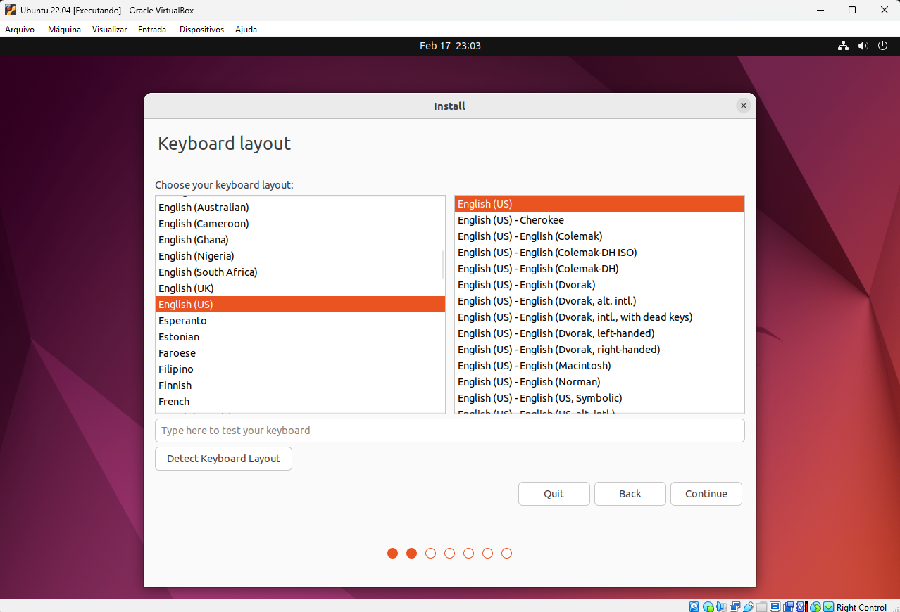
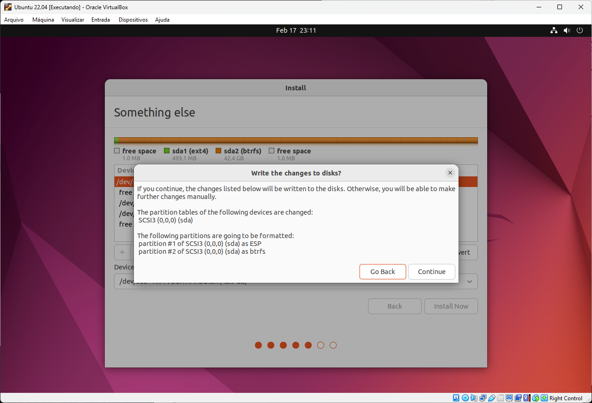
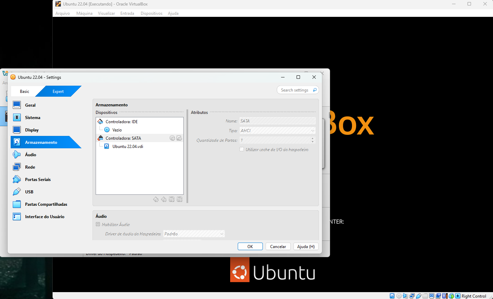

# Instalação do Ubuntu

Agora, independente de se você está usando a máquina virtual ou se está instalando diretamente no seu computador, os procedimentos serão os mesmos.

Ao iniciar a máquina virtual ou o seu computador, você encontrará a seguinte tela possibilitando o teste ou instalação do Linux Ubuntu. Nesta tela selecione "Try or Install Ubuntu" e pressione <strong>ENTER</strong>

Após carregar a instalação, escolha: <strong>Instaall Ubuntu</strong>

Na próxima tela, vamos manter os idiomas English (US). É possível trocar com facilidade o idioma posteriormente.

Na próxima tela, vamos escolher <strong>Normal Instalaton</strong> para que a instalação proceda com todos os pacotes da instalação padráo.

Nesta tela devemos escolher <strong>Something else</strong> para escolhermos os detalhes da instalação.

💡 <strong>Dica:</strong> - Se você escolher a primeira opção, apagará <strong>TODO</strong> o conteúdo do seu computador.

 

Vamos tratar com <strong>muita atenção</strong> esta estapa. Se você está instalando na sua <strong> Máquina Virtual</strong> ou em um <strong>SSD independente</strong> no seu computador, você precisa criar uma partição de 500MB, do tipo <strong>UEFI System Partigion</strong>, clicando duas vezes sobre o espaço vazio.

O mapa de partições ficará da seguinte forma:

Agora, tanto no caso anterior quanto se você está instalando como segundo sistema operacional no mesmo SSD do seu windows, você deve criar outra partição - que ocupará todo o espaço livre - do tipo <strong>btrfs journaling file system</strong>. Escolha também o ponto de montagem: <strong>Mount point: /</strong>.

Depois de criar ambas as partiçÕes, o mapa de partições ficará assim:

Ao clicar em <strong>Install Now</strong> aparecerá uma tela pedindo para confirmar as alterações no disco. Se tudo estiver correto, clique em <strong>Continuar</strong>.

A partir de agora, você escolherá o fuso horário (clicando próximo de sua região) e os demais dados da sua conta como nome do computador, nome do usuário e senha. Veja as próximas telas.

Agora, ao clicar em <strong>Continuar</strong> ele iniciará a instalação.

Ao terminar a instalação, Clique em <strong>Restart Now</strong>. Ele iniciará o reinício e interromperá na sequência pedindo para que você retire o pendrive de instalação e pressione enter.

Se você estiver instalando no PC, basta retirar Enter. Se estiver no Virtual Box, apenas pressione Enter.

Se você estiver no VirtualBox, clique em configurações, Armazenamento e Retire a imagem (arquivo iso) do drive virtual de CD. Clique em <strong>OK</strong> e feche as configurações. Pressione Enter.

Pronto, sua instalação foi concluída! Agora ao reiniciar, você verá a tela do Grub (gerenciador de inicialização do linux). Se você não fizer nada por 30s ele iniciará o Ubuntu, você também pode escolher com as setas e pressionar Enter.

Em todas as inicializações, ele fará uma breve checagem no sistema de arquivos. É aconselhavel que não cancele. Leva poucos segundos.

Agora basta escolher o seu usuário e colocar a sua senha.

Na primeira inicialização ele perguntará quais contas você quer manter conectada com seu sistema. Sinta-se a vontade para fazer em outro momento. Clique em <strong>Next</strong>.

Recomendo fortemente que se inscreva, posteriormente, no Ubuntu Pro que trás algumas atualizações de segurança a mais, dentre outros pacotes.

Você já está no ambiente totalmente configurado para uso. Se estiver utilizando a máquina virtual, você já tem a conexão internet configurada. Se não tiver, basta clicar na parte superior direita e conectar.

