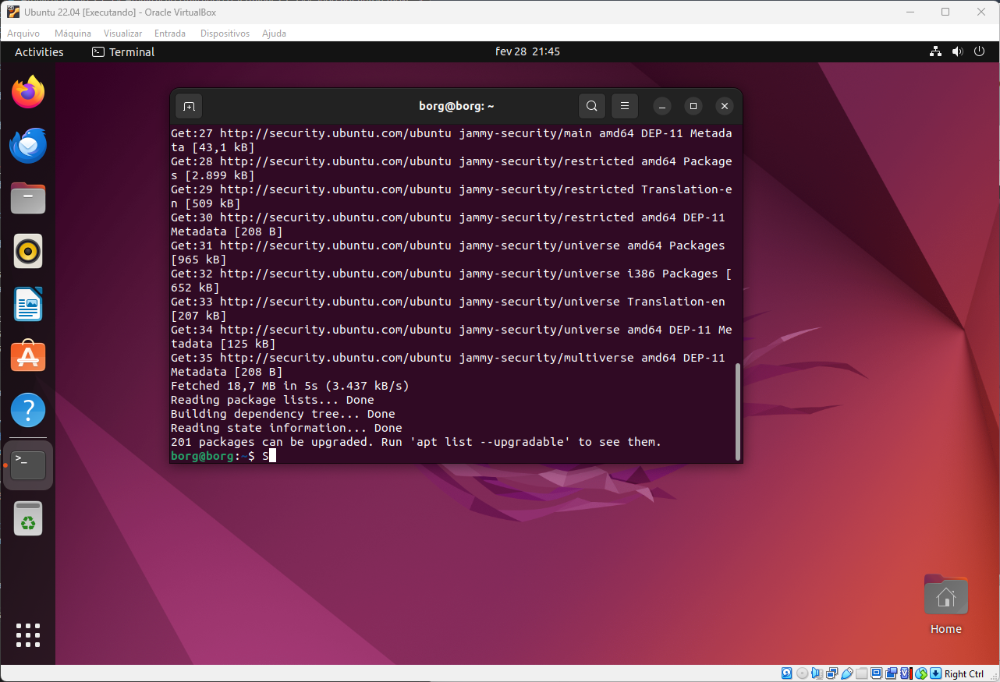
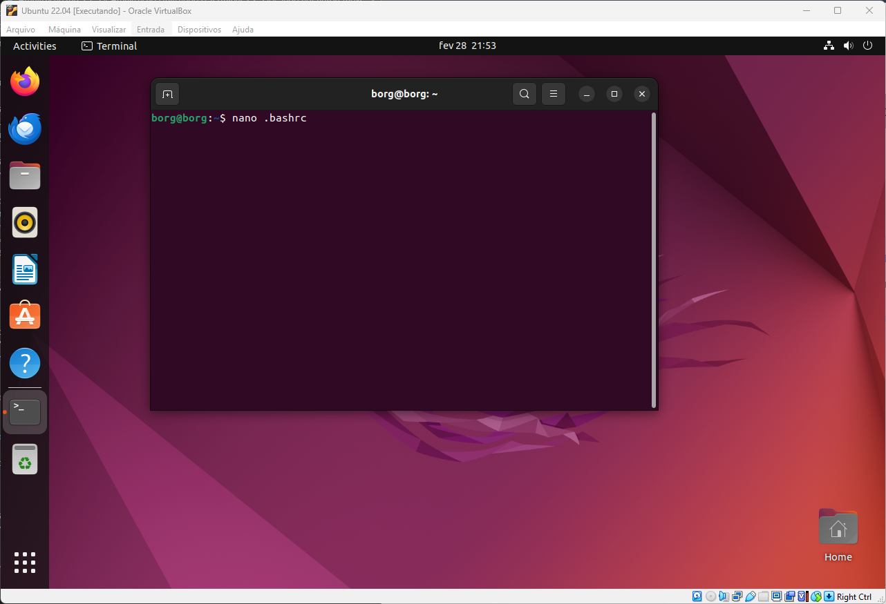
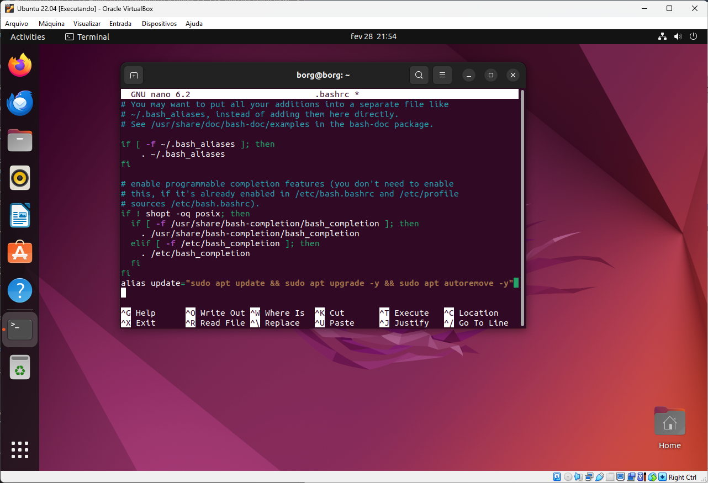
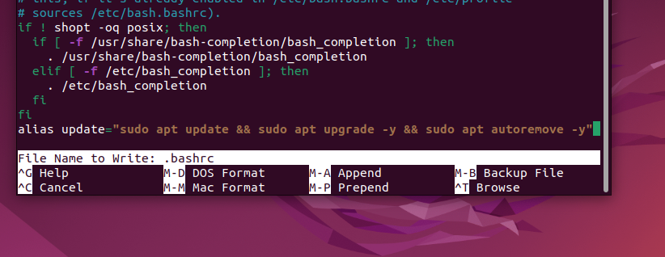
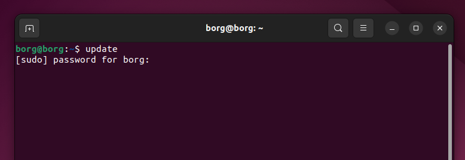
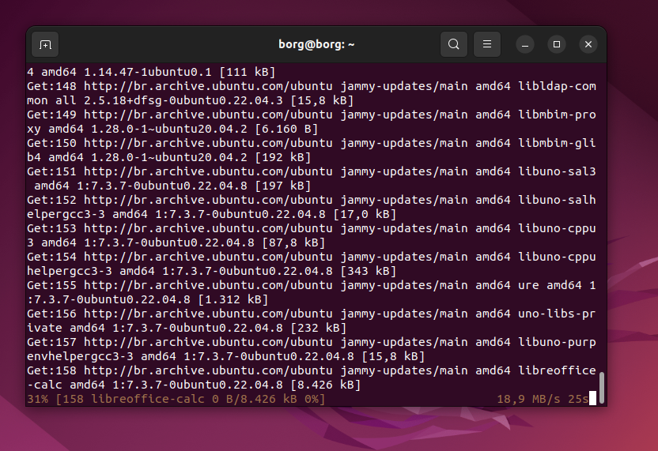

[](){ #atualizacao }
# Atualização do Sistema Ubuntu Usando o Terminal

Nesta lição, vamos aprender como atualizar o sistema Ubuntu usando o terminal. Também criaremos um "apelido" (alias) para tornar esse processo mais fácil no futuro.

## Por que usar o terminal?

Você pode estar se perguntando por que usamos o terminal em vez da interface gráfica. Aqui estão algumas razões:

* Temos mais controle sobre o que está acontecendo
* Aprendemos mais sobre como o sistema funciona
* Evitamos atualizações não desejadas para versões mais novas do Ubuntu

Este último ponto é importante! Por exemplo, em algumas aulas de Engenharia da Computação, usamos programas que só funcionam com versões específicas do Ubuntu. Se atualizarmos para uma versão mais nova sem querer, esses programas podem parar de funcionar.

## Comandos para atualização

Para atualizar o sistema, usamos três comandos principais:


``` bash 
sudo apt update
sudo apt upgrade -y
sudo apt autoremove -y
``` 

Vamos entender o que cada comando faz:

### sudo apt update

Este comando atualiza a lista de programas disponíveis. Ele:
- Verifica os repositórios (locais onde o Ubuntu busca programas)
- Baixa informações sobre as versões mais recentes dos programas
- Atualiza a lista local de programas disponíveis

Importante: Este comando não instala nada, só atualiza a lista.

### sudo apt upgrade -y

Este comando instala as versões mais novas dos programas que já estão no seu computador. O "-y" significa "sim" para todas as perguntas que o sistema fizer. Ele:
- Verifica quais programas têm atualizações
- Baixa e instala essas atualizações
- Resolve problemas de dependência (quando um programa precisa de outro para funcionar)

### sudo apt autoremove -y

Este comando remove programas que não são mais necessários. Ele:
- Identifica programas que foram instalados automaticamente e não são mais necessários
- Remove esses programas
- Libera espaço no seu disco rígido

## Como usar estes comandos

1. Abra o terminal pressionando <kbd>Ctrl</kbd> + <kbd>Alt</kbd> + <kbd>T</kbd>
2. Digite cada comando e pressione Enter
3. Quando pedir, digite sua senha (não se preocupe se não aparecer nada na tela enquanto digita, é normal!)

<div style="border: 1px solid rgb(19, 20, 20); border-left-width: 5px; padding: 10px; background-color:rgb(175, 178, 181); border-radius: 5px;">
💡 <strong>Dica:</strong> Quando você digita sua senha no terminal, nenhum caractere aparece. Isso é uma medida de segurança do Linux.
</div>
<br>


Após alguns instantes, é exibida uma mensagem dizendo que há pacotes atualizáveis:



Agora vamos ao ponto interessante, vamos criar um <strong>alias</strong> para fazer os três comandos ao mesmo tempo.

## Criando um atalho (alias)

Agora vamos ao ponto interessante: criaremos um **alias** para executar os três comandos simultaneamente.

Para esta tarefa, usaremos um editor de texto do terminal chamado **nano**. O arquivo que editaremos se chama **.bashrc**.

<div style="border: 1px solid rgb(19, 20, 20); border-left-width: 5px; padding: 10px; background-color:rgb(175, 178, 181); border-radius: 5px;">
💡 <strong>Dica:</strong> Todo arquivo que começa com o caractere "." é um arquivo oculto.
</div>


Para concatenar comandos, usamos a seguinte sequência de símbolos: "&&".
O comando que precisaremos é:


``` bash
sudo apt update && sudo apt upgrade -y && sudo apt autoremove -y
```

Para criar um apelido para este comando inteiro, usaremos a palavra-chave **alias**:


``` bash
alias update="sudo apt update && sudo apt upgrade -y && sudo apt autoremove -y"
```
Agora, vamos aplicar todo esse conhecimento. Para editar o arquivo, use o comando:

``` bash
nano .bashrc
```



Após o editor abrir, use as setas do teclado para ir até a última linha do arquivo e adicione o comando para criar o alias.



Para salvar a alteração, use duas combinações de teclas:
<kbd>Ctrl</kbd> + <kbd>O</kbd> para salvar e <kbd>Ctrl</kbd> + <kbd>X</kbd> para sair.



Agora, feche o terminal e abra um novo para que as modificações entrem em vigor.

No novo terminal, vamos testar nosso novo atalho, ou "alias". Digite o comando `update` e pressione Enter. Não se esqueça de inserir sua senha quando solicitado.



O sistema buscará por atualizações disponíveis:



Em seguida, instalará todas as atualizações disponíveis.


Após concluir, o sistema removerá os pacotes desnecessários e retornará ao prompt inicial, como mostrado abaixo:


Agora que você sabe criar seu próprio **alias**, pode criar quantos desejar para simplificar suas tarefas no terminal.
