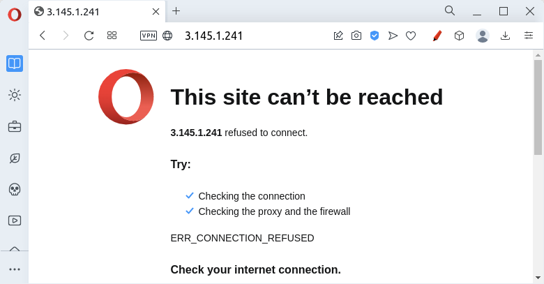
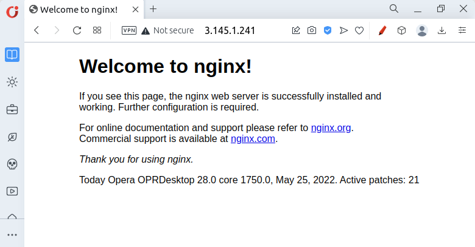
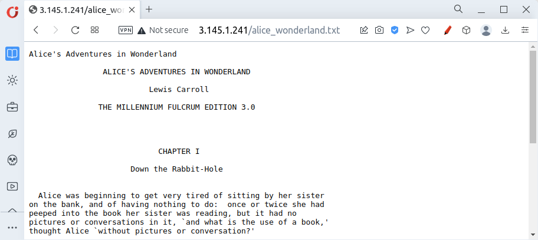
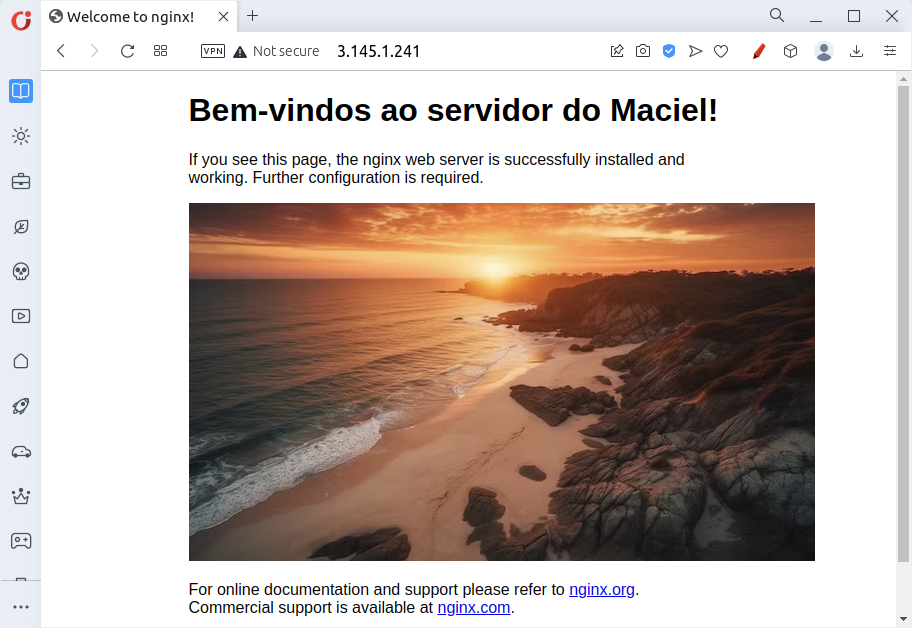

# Servidor Web

Um **servidor Web** é um software que hospeda e fornece conteúdo na internet. Ele recebe solicitações de clientes (como navegadores) e envia as páginas web correspondentes como resposta.

!!! info
    Toda vez que você acessa um site no Chrome, está interagindo com algum servidor Web!

## Conferir VM

Vamos conferir se a nossa máquina possui um servidor Web ativo. Para isto, digite no seu navegador `http://3.145.1.241`.

!!! danger
    Lembre de substituir o **IP** `3.145.1.241` pelo **IP** da máquina utilizada em sua atividade. Este (3.145.1.241) é apenas um exemplo!



Note que obtivemos um erro. Não há servidor Web configurado na máquina virtual. Mas vamos configurar um!

## Instalar `nginx`

O **Nginx** é um software usado para configurar e hospedar sites na internet. É um servidor web de alto desempenho, conhecido por sua escalabilidade e eficiência no processamento de solicitações HTTP.

Para fazer sua instalação, utilize:

!!! info
    Execute o comando abaixo e aperte **ENTER** (ou digite **Y e ENTER**) ao ser questionado se deseja continuar.


<div class="termy">

    ```console
    $ sudo apt update
    $ sudo apt install nginx
    ```

</div>
<br>

Acesse novamente, no seu navegador `http://3.145.1.241`.

!!! danger
    Lembre de substituir o **IP** `3.145.1.241` pelo **IP** da máquina utilizada em sua atividade. Este (3.145.1.241) é apenas um exemplo!

Uma imagem semelhante a esta indica que houve sucesso na intalação.



Pronto! Agora você tem um servidor Web disponível em sua máquina virtual da AWS!

## Serviço `nginx`

O `nginx` roda como um serviço no Linux. Um serviço é um programa ou aplicativo que é executado em segundo plano, de forma contínua, fornecendo funcionalidades específicas para o sistema operacional ou para os usuários.

O comando `sudo systemctl status nginx` pode ser utilizado para conferir o status do serviço `nginx`.

<script src="https://asciinema.org/a/657945.js" id="asciicast-657945" async="true"></script>

!!! tip
    Aperte "`q`" no teclado para sair do comando de status e voltar ao terminal!

Vamos parar o serviço momentaneamente com:

<div class="termy">

    ```console
    $ sudo systemctl stop nginx
    ```

</div>
<br>

!!! exercise
    Confira o status atual do serviço e garanta que ele está parado.

    !!! answer
        <div class="termy">

        ```console
        $ sudo systemctl status nginx
        ```

        </div>
        <br>

!!! exercise text short
    Acesse novamente, no seu navegador `http://3.145.1.241`.

    !!! danger
        Lembre de substituir o **IP** `3.145.1.241` pelo **IP** da máquina utilizada em sua atividade. Este (3.145.1.241) é apenas um exemplo!

    Você consegue acessar a paǵina?

    !!! answer
        Não! Como o serviço está parado, a página não é retornada.

        

!!! exercise
    Reinicie o serviço com:

    <div class="termy">

    ```console
    $ sudo systemctl restart nginx
    ```

    </div>
    <br>

!!! exercise text short
    Acesse novamente, no seu navegador `http://3.145.1.241`.

    !!! danger
        Lembre de substituir o **IP** `3.145.1.241` pelo **IP** da máquina utilizada em sua atividade. Este (3.145.1.241) é apenas um exemplo!

    Você consegue acessar a paǵina?

    !!! answer
        Sim! Como o serviço está rodando novamente, a página é retornada.

        

## Servir Arquivos

Por padrão, os arquivos do `nginx` ficam em `/var/www/html`.

Utilize o comando `ls -l /var/www/html` para listar o conteúdo desta pasta:

<div class="termy">

    ```console
    $ ls -l /var/www/html
    total 4
    -rw-r--r-- 1 root root 612 May  5 20:31 index.nginx-debian.html
    ```

</div>
<br>

!!! exercise text short
    Qual usuário é dono do arquivo `index.nginx-debian.html`?

    !!! answer
        O usuário **root**!

!!! exercise text long
    Liste o conteúdo do arquivo `index.nginx-debian.html`.

    <script src="https://asciinema.org/a/657943.js" id="asciicast-657943" async="true"></script>

    Você consegue ver alguma semelhança entre o que está escrito neste arquivo e a página retornada ao acessar, no seu navegador, `http://3.145.1.241`?

    !!! danger
        Lembre de substituir o **IP** `3.145.1.241` pelo **IP** da máquina utilizada em sua atividade. Este (3.145.1.241) é apenas um exemplo!

### Servir Alice no País das Maravilhas!

Vamos copiar o arquivo `alice_wonderland.txt` para a pasta `/var/www/html` e verificar se conseguimos disponibilizar acesso a ele!

!!! tip
    Para copiar arquivos, utilizamos o comando `cp origem destino` , onde:
    
    - `origem` representa o arquivo a ser copiado
    - `destino` representa para onde queremos copiar

Para isto, utilize no terminal:

!!! info
    Perceba que, antes de copiar, vamos garantir que estamos na pasta certa (`/home/boss/downloads`).

<div class="termy">

    ```console
    $ cd ~
    $ cd downloads
    $ pwd
    /home/boss/downloads
    $ sudo cp alice_wonderland.txt /var/www/html/
    ```

</div>
<br>

!!! exercise
    Acesse novamente, no seu navegador `http://3.145.1.241/alice_wonderland.txt`.

    !!! danger
        Lembre de substituir o **IP** `3.145.1.241` pelo **IP** da máquina utilizada em sua atividade. Este (3.145.1.241) é apenas um exemplo!

    Você consegue acessar o arquivo? Deve aparecer assim:

    

!!! info
    Pronto! Agora o arquivo `alice_wonderland.txt` está está disponível para todas as pessoas que tiverem o endereço IP da máquina!

!!! tip
    Para **copiar pastas**, utilizamos o comando `cp -r origem destino` , onde:
    
    - `origem` representa a pasta a ser copiada
    - `destino` representa para onde queremos copiar

    O `-r` faz com que a pasta seja copiada *recursivamente*, ou seja, tudo que está dentro dela também será copiado.

## Exercícios


### Disponibilizar e remover

!!! exercise
    Disponibilize publicamente outro arquivo em seu servidor Web.

    Confira se possui acesso a ele.

!!! exercise
    Remova da pasta `/var/www/html/` o arquivo disponibilizado no exercício anterior.

    !!! tip
        Para remover, basta utilizar o comando `sudo rm`, seguido pelo **caminho do arquivo**.
        
    Vamos supor que você copiou o arquivo `livros.txt`. Para remover, fazemos:
    
    <div class="termy">

    ```console
    $ sudo rm /var/www/html/livros.txt
    ```

    </div>
    <br>

### Alterar arquivo

!!! exercise
    Utilize o `vim` para alterar o arquivo `/var/www/html/index.nginx-debian.html`.

    Faça alterações quaisquer, como:
    - Adicionar seu nome
    - Adicionar uma imagem:

    !!! tip
        Relembrando, os links dos tutoriais são [**tutorial vim 1**](https://www.youtube.com/watch?v=95Fzh-HveQg) e [**tutorial vim 2**](https://www.youtube.com/watch?v=EscyTZSaHXA).

        Caso não queira ver vídeos (ou esteja sem fone), algumas sugestões de tutoriais em formato texto são [**tutorial vim 3**](https://br-linux.org/artigos/vim_intro.htm) e [**tutorial vim 4**](https://www.inf.ufpr.br/gregio/CI1056/TutorialVIM.pdf).

    !!! tip
        Para adicionar uma imagem, podemos adicionar a ao texto da página:

        ``

        onde `caminho_imagem` representa o localizador de alguma imagem.

        Por exemplo:

        <style>
        small {
            font-size: 60%;
        }
        </style>

        <small>``</small>

    Veja o processo de edição:
    
    <script src="https://asciinema.org/a/657950.js" id="asciicast-657950" async="true"></script>

    E o resultado:

    

## Referências
- https://images.nationalgeographic.org/image/upload/v1639146339/EducationHub/photos/pillars-of-creation.jpg
- https://img.freepik.com/fotos-gratis/um-por-do-sol-sobre-uma-praia-com-um-por-do-sol-dourado-ao-fundo_188544-33419.jpg